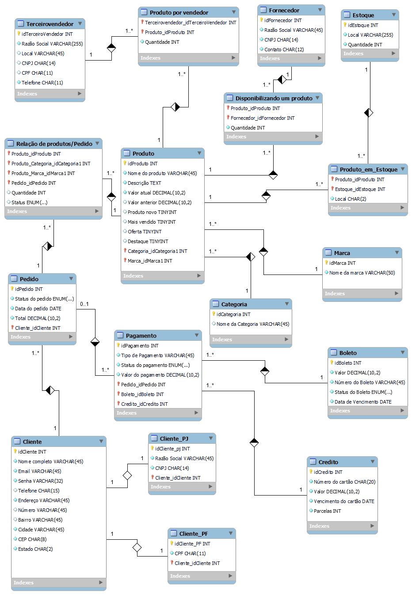

# Projeto Lógico de Banco de Dados

## E-commerce Refinado

Neste desafio de projeto foi feito  o refinamento de um 
Banco de Dados para o cenário de um E-commerce.
Começando desde o planejamento como:
<ol>
    <li>Pensar nas entidades que poderiam fazer parte do E-commerce.</li>
    <li>Quais seriam os campos para cada entidade.</li>
    <li>A construção do projeto.</li>
</ol>

## Modelo

